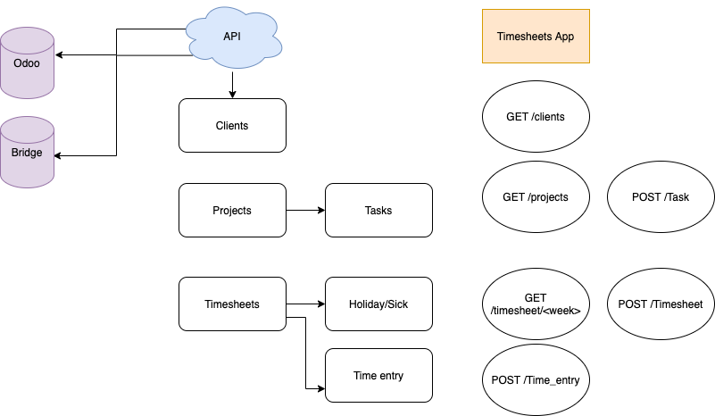

# Uren registratie

Een applicatie die het mogelijk maakt om gewerkte uren te registreren

## Functionaliteit
- Wekenlijks wordt een urensheet ingevuld
- Per regel kan worden aangegeven of het voor een klant/project/contract wordt gewerkt
- per medewerker kunnen alle relevante klanten opgehaald worden
- een timesheet moet per week ingestuurd worden
- een timesheet wordt approved door een manager
- er is een dag en een week weergave

Lege dag weergave


Add entry


Invoerscherm week


## Data

- Clients
- Project
- Task (default tasks)
- Timesheet
- Time_entry
- User





# API

## Clients

`GET /client`

**request**
```json
 {

 }
 ```
 
**response**

```json
{
  "first_name": "Lasse",
  "last_name": "Capel",
  "id": 123,
  "active": true
}
```


## Timesheet

`GET /timesheet`

```json

{
  "week_of": "2020-06-29",
  "submitted": true,
  "approved": false,
  "any_approved": false,
  "has_previous_time_entries": false,
  "day_entries": [
    {
      "id": 1266107228,
      "hours": 8.0,
      "spent_at": "2020-07-02",
      "notes": null,
      "timer_started_at": null,
      "is_closed": false,
      "invoice_id": 0,
      "created_at": "2020-07-02T07:09:14Z",
      "updated_at": "2020-07-02T07:09:14Z",
      "user_id": 3298302,
      "project_id": 25368162,
      "project_name": "Webshop",
      "project_code": null,
      "client_name": "Ahold",
      "task_id": 14780757,
      "task_name": "Design",
      "project_active": true,
      "task_active": true,
      "task_assignment_active": true,
      "user_active": true,
      "user_assignment_active": true,
      "is_archived": false,
      "billable": true,
      "is_billed": false
    },
    ...
}
```

`POST /timesheet`
```json
```
